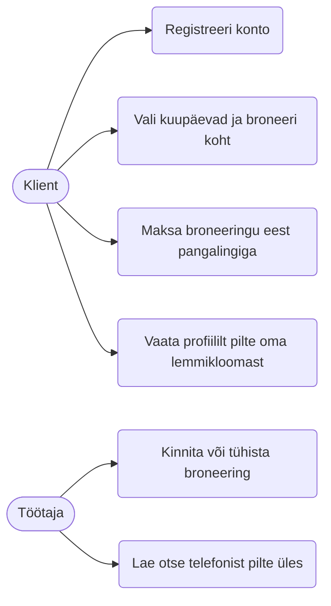
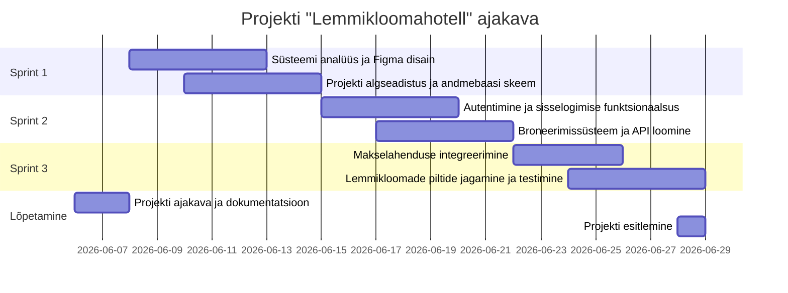

# Lemmikloomahotell - Broneerimis- ja haldussüsteem

## 1. Projekti kirjeldus ja sihtgrupp
Lemmikloomahotelli projekt on broneerimis- ja haldussüsteem, mis aitab muuta klientide ja hotelli töötajate suhtluse sujuvamaks. Süsteem on mõeldud kahele sihtgrupile:
- **Kliendid**: Lemmikloomaomanikud, kes soovivad oma lemmikule (koerale, kassile vms) ajutiselt hotellikohta broneerida ja nende eest tasuda.
- **Töötajad**: Lemmikloomahotelli personal, kes haldavad saabuvaid broneeringuid ning saavad klientidega pilte jagada, et tagada omaniku meelerahu.

## 2. Meeskond
- **Tarkvaraarenduse meeskond:** Dima Allikvee, Juri Allikvee ( [JuriAllikvee](https://github.com/JuriAllikvee) )

## 3. Kasutatavad tehnoloogiad
- **Frontend (Kliendi ja töötaja vaade):** React.js, Tailwind CSS (kasutajaliides)
- **Backend (Server ja andmetöötlus):** Node.js, Express.js
- **Andmebaas ja tagasisüsteem (BaaS):** Supabase (PostgreSQL andmebaas ja autentimine)
- **Pilveteenused ja pildihoidla:** Supabase Storage (lemmikloomade piltide hoiustamiseks)
- **Koodihaldus ja projektijuhtimine:** GitHub, GitHub Projects (Kanban)

## 4. Valitud arhitektuur ja metoodika
**Arhitektuur: Monoliitne arhitektuur**
*Miks?* Kuna hotellil on ainult kaks töötajat ja klientide arv on suhteliselt väike, on monoliitne arhitektuur odavam, lihtsam ja kiirem valmis ehitada. Süsteem ei vaja keerulist mikroteenuste ülesehitust.

**Arendusmetoodika: Scrum**
*Miks?* Scrum pakub paindlikkust. Iga 2 nädala tagant (ühe sprindi lõpus) saab kliendile näidata uusi funktsioone ja vastavalt tagasisidele muudatusi teha (näiteks piltide jagamise funktsionaalsuse täpsustamine).

## 5. Nõuded süsteemile

### Funktsionaalsed nõuded (Mida rakendus teeb?)
1. Klient saab valida kalendrist kuupäevad ja broneerida lemmikloomale koha.
2. Klient saab broneeringu eest tasuda turvaliselt veebis pangalingiga.
3. Klient saab logida sisse oma profiilile ja vaadata pilte oma lemmikloomast, mis on töötajate poolt üles laetud.
4. Töötaja saab süsteemi sisse logida ning broneeringuid kinnitada või vajadusel tühistada.
5. Kasutaja (klient) saab endale rakenduses konto registreerida.

### Mittefunktsionaalsed nõuded (Kuidas rakendus töötab?)
1. **Kiirus:** Broneerimisvorm peab laadima vähem kui 2 sekundiga, et tagada sujuv kasutuskogemus.
2. **Turvalisus:** Kasutaja konto kaitsmiseks peab parool olema vähemalt 8 tähemärki pikk.
3. **Mahutavus/Jõudlus:** Süsteem peab suutma toetada vähemalt kuni 20 üheaegset broneeringu tegemist ilma tõrgeteta.

## 6. UML Kasutusjuhtumi (Use Case) diagramm



## 7. Tööplaan (Sprindid)

Projekti arendus on jaotatud nelja kahenädalasse sprinti:

- **Sprint 1: Kavandamine ja arhitektuuri loomine**
  - Süsteemi analüüs ja disain (Figma prototüübid).
  - GitHubi repositooriumi ja Kanban tahvli seadistamine.
  - Projekti algseadistus (React ja Node.js keskkond) ja andmebaasi skeemi loomine.

- **Sprint 2: Andmebaas, autentimine ja broneerimise API**
  - Andmebaasi ühendamine.
  - Kasutajate (klientide ja töötajate) sisselogimise ja registreerimise funktsionaalsuse loomine.
  - Backendi API loomine broneeringute salvestamiseks.

- **Sprint 3: Kliendi vaade ja makselahendus**
  - Kliendi broneerimisvormi ja kasutajaliidese arendamine (Frontend).
  - Broneerimisvormi kiiruse optimeerimine (laadimisaeg alla 2 sek).
  - Pangalinkide API integreerimine broneeringu tasumiseks.

- **Sprint 4: Töötaja vaade, pildid ja testimine**
  - Töötajate vaate (dashboard) arendamine broneeringute kinnitamiseks/tühistamiseks.
  - Piltide üleslaadimise süsteemi arendus ja ühendamine kliendi vaatega.
  - Kogu süsteemi testimine (funktsionaalne, turvalisus ja jõudlus).
  - Lõplik vigade parandus ning üleandmine.

## 8. Projekti ajakava (Gantti diagramm)



## 9. Kuidas süsteemi paigaldada ja käivitada (Juurutusplaan)

See juhend kirjeldab samm-sammult, kuidas seadistada arenduskeskkond, luua andmebaas ja käivitada Lemmikloomahotelli rakendus.

---

### 9.1 Sõltuvused (Dependencies)

Süsteemi käivitamiseks on vajalik järgmine tarkvara:
* **Node.js**: v18.0.0 või uuem (soovitatav LTS versioon v20.x)
* **npm**: v10.0.0 või uuem (tuleb koos Node.js-iga)
* **Git**: v2.40+ (koodi haldamiseks)
* **Supabase (BaaS)**: pilvepõhine andmebaas ja autentimine (eraldi kohalikku PostgreSQL-i paigaldama ei pea)

---

### 9.2 Andmebaasi seadistamine

Projekt kasutab andmebaasina ja autentimiseks pilvepõhist **Supabase (BaaS)** platvormi.

#### Seadistamise sammud:
1. Loo konto ja uus projekt aadressil [supabase.com](https://supabase.com/).
2. Loo andmebaasis vajalikud põhitabelid (nt Supabase SQL Editori või Table Editori kaudu):
   * `profiles` (kasutajate profiilid ja rollid: client, worker)
   * `pets` (lemmikloomad)
   * `bookings` (broneeringud)
   * `photos` (lemmikloomade pildid)
3. Kopeeri projekti seadetest **Project URL** ja **API anon key**, et lisada need keskkonnamuutujate `.env` failidesse (vt jaotist 9.3).

---

### 9.3 Süsteemi käivitamine

#### Samm 1: Koodi kloonimine ja projektikausta sisenemine
```bash
git clone https://github.com/DimaAllikvee/Lemmikloomahotell-Projekt.git
cd Lemmikloomahotell-Projekt
```

#### Samm 2: Keskkonnamuutujate seadistamine (Environment Variables)

Loo projekti alamkaustadesse keskkonnamuutujate failid vastavalt näidistele.

**1. Backendi seadistus (`/backend/.env`):**
```env
PORT=5000
SUPABASE_URL=https://your-project-id.supabase.co
SUPABASE_KEY=your-supabase-service-role-key
```

**2. Frontendi seadistus (`/frontend/.env`):**
```env
VITE_SUPABASE_URL=https://your-project-id.supabase.co
VITE_SUPABASE_ANON_KEY=your-supabase-anon-key
VITE_API_URL=http://localhost:5000
```

#### Samm 3: Teenuste käivitamine arendusrežiimis

##### A. Backendi käivitamine
Ava uus terminaliaken, mine backendi kausta, paigalda sõltuvused ja käivita server:
```bash
cd backend
npm install
npm run dev
```
*Kui `npm run dev` pole veel seadistatud, saab serveri käivitada otse käsuga:*
```bash
node server.js
```

##### B. Frontendi käivitamine
Ava teine terminaliaken, mine frontendi kausta, paigalda sõltuvused ja käivita React/Vite arendusserver:
```bash
cd frontend
npm install
npm run dev
```

---

### 9.4 Juurutamise õnnestumise kontroll

Süsteemi toimivust saad kontrollida järgmiselt:

1. **Backend API Tervisekontroll (Health Check)**:
   Teosta GET päring aadressile `http://localhost:5000/api/health`.
   *Oodatav vastus:* `{"status": "ok", "database": "connected"}`
2. **Frontend Kasutajaliides**:
   Ava veebilehitsejas `http://localhost:5173` (või terminalis kuvatud aadress). Peaks avanema lemmikloomahotelli avaleht.
3. **Supabase Ühendus**:
   Proovi registreerida uus kasutaja frontendi liideses. Kui konto tekib Supabase Auth sektsiooni ja andmebaasi tabelisse `public.profiles`, on ühendus edukalt loodud.

## 10. Ressursid ja Tehnoloogiad

### Tehnoloogiline Pinu (Tech Stack & Tools)

- **Infrastruktuur:** 1x VPS-server (2 GB RAM, 1 vCPU, Ubuntu 24.04). See on minimaalne konfiguratsioon Node.js backendi ja React frontendi majutamiseks.
- **Tarkvara:** Node.js (v18.0.0+), npm (v10.0.0+), Git (v2.40+), React, Tailwind CSS, Express.js.
- **Välised teenused:** Supabase (BaaS PostgreSQL andmebaasi ja autentimise jaoks). 

### Virtuaalse Eelarve Koostamine

| Ressursi tüüp | Kogus / Maht | Ühiku hind | KOKKU (€) |
| --- | --- | --- | --- |
| Tööjõud – Arendaja 1 | 60 tundi | 35 € / h | 2 100,00 € |
| Tööjõud – Arendaja 2 | 60 tundi | 35 € / h | 2 100,00 € |
| Tööjõud – Projektijuht | 60 tundi | 40 € / h | 2 400,00 € |
| Serveri rent (VPS, 1 aasta) | 12 kuud | 5,50 € / kuu | 66,00 € |
| Domeen (.ee, 1 aasta) | 1 tk | 12,00 € | 12,00 € |
| Claude Code (Max Plan) | 1 aasta | 250,00 € / aasta | 250,00 € |
| **KOGUSUMMA** | | | **6 928,00 €** |
