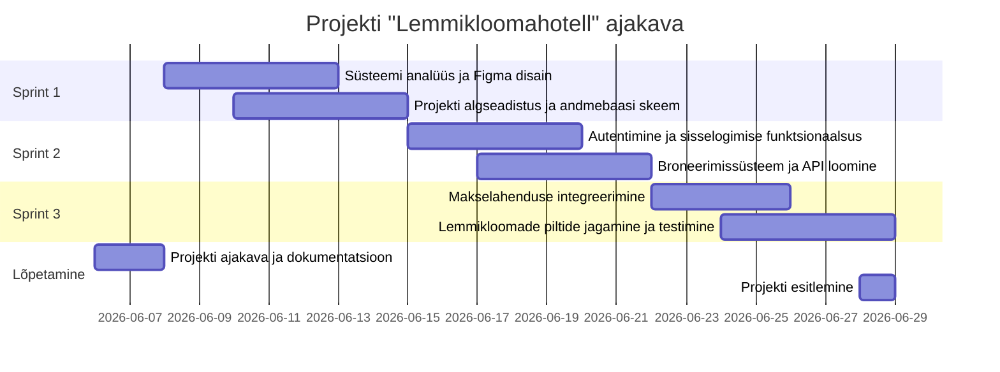

# Lemmikloomahotell - Broneerimis- ja haldussüsteem

## 1. Projekti kirjeldus ja sihtgrupp
Lemmikloomahotelli projekt on broneerimis- ja haldussüsteem, mis aitab muuta klientide ja hotelli töötajate suhtluse sujuvamaks. Süsteem on mõeldud kahele sihtgrupile:
- **Kliendid**: Lemmikloomaomanikud, kes soovivad oma lemmikule (koerale, kassile vms) ajutiselt hotellikohta broneerida ja nende eest tasuda.
- **Töötajad**: Lemmikloomahotelli personal, kes haldavad saabuvaid broneeringuid ning saavad klientidega pilte jagada, et tagada omaniku meelerahu.

## 2. Meeskond
- **Tarkvaraarenduse meeskond:** Dima Allikvee, Juri Allikvee ( [JuriAllikvee](https://github.com/JuriAllikvee) )

## 3. Kasutatavad tehnoloogiad
- **Frontend (Kliendi ja töötaja vaade):** React.js, Tailwind CSS (kasutajaliides)
- **Backend (Server ja andmetöötlus):** Node.js, Express.js
- **Andmebaas ja tagasisüsteem (BaaS):** Supabase (PostgreSQL andmebaas ja autentimine)
- **Pilveteenused ja pildihoidla:** Supabase Storage (lemmikloomade piltide hoiustamiseks)
- **Koodihaldus ja projektijuhtimine:** GitHub, GitHub Projects (Kanban)

## 4. Valitud arhitektuur ja metoodika
**Arhitektuur: Monoliitne arhitektuur**
*Miks?* Kuna hotellil on ainult kaks töötajat ja klientide arv on suhteliselt väike, on monoliitne arhitektuur odavam, lihtsam ja kiirem valmis ehitada. Süsteem ei vaja keerulist mikroteenuste ülesehitust.

**Arendusmetoodika: Scrum**
*Miks?* Scrum pakub paindlikkust. Iga 2 nädala tagant (ühe sprindi lõpus) saab kliendile näidata uusi funktsioone ja vastavalt tagasisidele muudatusi teha (näiteks piltide jagamise funktsionaalsuse täpsustamine).

## 5. Nõuded süsteemile

### Funktsionaalsed nõuded (Mida rakendus teeb?)
1. Klient saab valida kalendrist kuupäevad ja broneerida lemmikloomale koha.
2. Klient saab broneeringu eest tasuda turvaliselt veebis pangalingiga.
3. Klient saab logida sisse oma profiilile ja vaadata pilte oma lemmikloomast, mis on töötajate poolt üles laetud.
4. Töötaja saab süsteemi sisse logida ning broneeringuid kinnitada või vajadusel tühistada.
5. Kasutaja (klient) saab endale rakenduses konto registreerida.

### Mittefunktsionaalsed nõuded (Kuidas rakendus töötab?)
1. **Kiirus:** Broneerimisvorm peab laadima vähem kui 2 sekundiga, et tagada sujuv kasutuskogemus.
2. **Turvalisus:** Kasutaja konto kaitsmiseks peab parool olema vähemalt 8 tähemärki pikk.
3. **Mahutavus/Jõudlus:** Süsteem peab suutma toetada vähemalt kuni 20 üheaegset broneeringu tegemist ilma tõrgeteta.

## 6. UML Kasutusjuhtumi (Use Case) diagramm


## 7. Tööplaan (Sprindid)

Projekti arendus on jaotatud nelja kahenädalasse sprinti:

- **Sprint 1: Kavandamine ja arhitektuuri loomine**
  - Süsteemi analüüs ja disain (Figma prototüübid).
  - GitHubi repositooriumi ja Kanban tahvli seadistamine.
  - Projekti algseadistus (React ja Node.js keskkond) ja andmebaasi skeemi loomine.

- **Sprint 2: Andmebaas, autentimine ja broneerimise API**
  - Andmebaasi ühendamine.
  - Kasutajate (klientide ja töötajate) sisselogimise ja registreerimise funktsionaalsuse loomine.
  - Backendi API loomine broneeringute salvestamiseks.

- **Sprint 3: Kliendi vaade ja makselahendus**
  - Kliendi broneerimisvormi ja kasutajaliidese arendamine (Frontend).
  - Broneerimisvormi kiiruse optimeerimine (laadimisaeg alla 2 sek).
  - Pangalinkide API integreerimine broneeringu tasumiseks.

- **Sprint 4: Töötaja vaade, pildid ja testimine**
  - Töötajate vaate (dashboard) arendamine broneeringute kinnitamiseks/tühistamiseks.
  - Piltide üleslaadimise süsteemi arendus ja ühendamine kliendi vaatega.
  - Kogu süsteemi testimine (funktsionaalne, turvalisus ja jõudlus).
  - Lõplik vigade parandus ning üleandmine.

## 8. Projekti ajakava (Gantti diagramm)



## 9. Kuidas süsteemi paigaldada ja käivitada (Juurutusplaan)

See juhend kirjeldab samm-sammult, kuidas seadistada arenduskeskkond, luua andmebaas ja käivitada Lemmikloomahotelli rakendus.

---

### 9.1 Sõltuvused (Dependencies)

Süsteemi käivitamiseks on vajalik järgmine tarkvara:
* **Node.js**: v18.0.0 või uuem (soovitatav LTS versioon v20.x)
* **npm**: v10.0.0 või uuem (tuleb koos Node.js-iga)
* **Git**: v2.40+ (koodi haldamiseks)
* **Supabase (BaaS)**: pilvepõhine andmebaas ja autentimine (eraldi kohalikku PostgreSQL-i paigaldama ei pea)

---

### 9.2 Andmebaasi seadistamine

Rakendus kasutab andmebaasina **Supabase (PostgreSQL)** platvormi. Järgi neid samme andmebaasi seadistamiseks:

#### Samm 1: Supabase projekti loomine
1. Logi sisse või loo konto aadressil [supabase.com](https://supabase.com/).
2. Loo uus projekt nimega `Lemmikloomahotell`.
3. Salvesta projekti **URL** ja **API Key (anon public)**, mida vajad hiljem keskkonnamuutujate seadistamisel.

#### Samm 2: Andmebaasi skeemi loomine
Ava Supabase paneelis **SQL Editor**, loo uus päring ja kopeeri sinna alljärgnev SQL-skeem, et luua vajalikud tabelid ja seosed:

```sql
-- 1. Kasutajate profiilide tabel (seotud Supabase Autentimisega)
CREATE TABLE public.profiles (
    id UUID REFERENCES auth.users ON DELETE CASCADE PRIMARY KEY,
    name TEXT NOT NULL,
    role TEXT CHECK (role IN ('client', 'worker')) DEFAULT 'client',
    created_at TIMESTAMP WITH TIME ZONE DEFAULT TIMEZONE('utc'::text, NOW()) NOT NULL
);

-- Luba profiilide tabeli lugemine kõigile autentitud kasutajatele
ALTER TABLE public.profiles ENABLE ROW LEVEL SECURITY;
CREATE POLICY "Kasutajad saavad näha kõiki profiile" ON public.profiles 
    FOR SELECT TO authenticated USING (true);

-- 2. Lemmikloomade tabel
CREATE TABLE public.pets (
    id UUID DEFAULT gen_random_uuid() PRIMARY KEY,
    owner_id UUID REFERENCES public.profiles(id) ON DELETE CASCADE NOT NULL,
    name TEXT NOT NULL,
    species TEXT NOT NULL, -- nt. koer, kass
    age INT,
    description TEXT,
    created_at TIMESTAMP WITH TIME ZONE DEFAULT TIMEZONE('utc'::text, NOW()) NOT NULL
);

ALTER TABLE public.pets ENABLE ROW LEVEL SECURITY;
CREATE POLICY "Kasutajad saavad näha enda lemmikloomi" ON public.pets 
    FOR ALL TO authenticated USING (auth.uid() = owner_id);

-- 3. Broneeringute tabel
CREATE TABLE public.bookings (
    id UUID DEFAULT gen_random_uuid() PRIMARY KEY,
    pet_id UUID REFERENCES public.pets(id) ON DELETE CASCADE NOT NULL,
    start_date DATE NOT NULL,
    end_date DATE NOT NULL,
    status TEXT CHECK (status IN ('pending', 'confirmed', 'cancelled')) DEFAULT 'pending',
    total_price NUMERIC(10, 2) NOT NULL,
    created_at TIMESTAMP WITH TIME ZONE DEFAULT TIMEZONE('utc'::text, NOW()) NOT NULL
);

ALTER TABLE public.bookings ENABLE ROW LEVEL SECURITY;
CREATE POLICY "Kliendid näevad oma broneeringuid" ON public.bookings 
    FOR SELECT TO authenticated USING (
        auth.uid() IN (SELECT owner_id FROM public.pets WHERE id = bookings.pet_id)
    );
CREATE POLICY "Töötajad näevad kõiki broneeringuid" ON public.bookings 
    FOR ALL TO authenticated USING (
        EXISTS (SELECT 1 FROM public.profiles WHERE id = auth.uid() AND role = 'worker')
    );

-- 4. Piltide tabel (lemmikloomade piltide viited)
CREATE TABLE public.photos (
    id UUID DEFAULT gen_random_uuid() PRIMARY KEY,
    booking_id UUID REFERENCES public.bookings(id) ON DELETE CASCADE NOT NULL,
    url TEXT NOT NULL,
    uploaded_by UUID REFERENCES public.profiles(id) NOT NULL,
    created_at TIMESTAMP WITH TIME ZONE DEFAULT TIMEZONE('utc'::text, NOW()) NOT NULL
);

ALTER TABLE public.photos ENABLE ROW LEVEL SECURITY;
CREATE POLICY "Kasutajad näevad oma lemmikloomade pilte" ON public.photos 
    FOR SELECT TO authenticated USING (
        auth.uid() IN (
            SELECT owner_id FROM public.pets p 
            JOIN public.bookings b ON p.id = b.pet_id 
            WHERE b.id = photos.booking_id
        )
    );
```

#### Samm 3: Testiandmete laadimine
Kopeeri ja käivita SQL Editoris järgmised käsud testiandmete sisestamiseks:

```sql
-- Lisame näitlikud profiilid (tavaliselt tekivad automaatselt registreerumisel)
-- Asenda '00000000-0000-0000-0000-000000000000' reaalsete kasutaja UUID-dega
INSERT INTO public.profiles (id, name, role) VALUES 
('d1a3c748-43bf-4786-90bd-1c9f80a0678d', 'Mari Murakas', 'client'),
('e2a4c849-44cf-4887-91bd-2c9f80b0679e', 'Jaan Tamm', 'worker')
ON CONFLICT (id) DO NOTHING;

-- Lisame lemmikloomad
INSERT INTO public.pets (id, owner_id, name, species, age, description) VALUES 
('a1a3c748-43bf-4786-90bd-1c9f80a0678d', 'd1a3c748-43bf-4786-90bd-1c9f80a0678d', 'Muri', 'Koer', 3, 'Sõbralik kuldne retriiver, kes armastab palle.')
ON CONFLICT (id) DO NOTHING;

-- Lisame näitliku broneeringu
INSERT INTO public.bookings (id, pet_id, start_date, end_date, total_price, status) VALUES 
('b1a3c748-43bf-4786-90bd-1c9f80a0678d', 'a1a3c748-43bf-4786-90bd-1c9f80a0678d', '2026-07-01', '2026-07-07', 150.00, 'pending')
ON CONFLICT (id) DO NOTHING;
```

---

### 9.3 Süsteemi käivitamine

#### Samm 1: Koodi kloonimine ja projektikausta sisenemine
```bash
git clone https://github.com/DimaAllikvee/Lemmikloomahotell-Projekt.git
cd Lemmikloomahotell-Projekt
```

#### Samm 2: Keskkonnamuutujate seadistamine (Environment Variables)

Loo projekti alamkaustadesse keskkonnamuutujate failid vastavalt näidistele.

**1. Backendi seadistus (`/backend/.env`):**
```env
PORT=5000
SUPABASE_URL=https://your-project-id.supabase.co
SUPABASE_KEY=your-supabase-service-role-key
```

**2. Frontendi seadistus (`/frontend/.env`):**
```env
VITE_SUPABASE_URL=https://your-project-id.supabase.co
VITE_SUPABASE_ANON_KEY=your-supabase-anon-key
VITE_API_URL=http://localhost:5000
```

#### Samm 3: Teenuste käivitamine arendusrežiimis

##### A. Backendi käivitamine
Ava uus terminaliaken, mine backendi kausta, paigalda sõltuvused ja käivita server:
```bash
cd backend
npm install
npm run dev
```
*Kui `npm run dev` pole veel seadistatud, saab serveri käivitada otse käsuga:*
```bash
node server.js
```

##### B. Frontendi käivitamine
Ava teine terminaliaken, mine frontendi kausta, paigalda sõltuvused ja käivita React/Vite arendusserver:
```bash
cd frontend
npm install
npm run dev
```

---

### 9.4 Juurutamise õnnestumise kontroll

Süsteemi toimivust saad kontrollida järgmiselt:

1. **Backend API Tervisekontroll (Health Check)**:
   Teosta GET päring aadressile `http://localhost:5000/api/health`.
   *Oodatav vastus:* `{"status": "ok", "database": "connected"}`
2. **Frontend Kasutajaliides**:
   Ava veebilehitsejas `http://localhost:5173` (või terminalis kuvatud aadress). Peaks avanema lemmikloomahotelli avaleht.
3. **Supabase Ühendus**:
   Proovi registreerida uus kasutaja frontendi liideses. Kui konto tekib Supabase Auth sektsiooni ja andmebaasi tabelisse `public.profiles`, on ühendus edukalt loodud.
