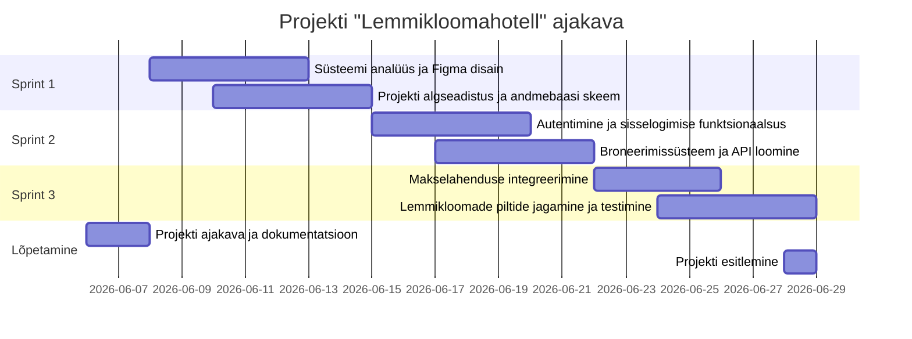

# Lemmikloomahotell - Broneerimis- ja haldussüsteem

## 1. Projekti kirjeldus ja sihtgrupp
Lemmikloomahotelli projekt on broneerimis- ja haldussüsteem, mis aitab muuta klientide ja hotelli töötajate suhtluse sujuvamaks. Süsteem on mõeldud kahele sihtgrupile:
- **Kliendid**: Lemmikloomaomanikud, kes soovivad oma lemmikule (koerale, kassile vms) ajutiselt hotellikohta broneerida ja nende eest tasuda.
- **Töötajad**: Lemmikloomahotelli personal, kes haldavad saabuvaid broneeringuid ning saavad klientidega pilte jagada, et tagada omaniku meelerahu.

## 2. Meeskond
- **Tarkvaraarenduse meeskond:** Dima Allikvee, Juri Allikvee ( [JuriAllikvee](https://github.com/JuriAllikvee) )

## 3. Kasutatavad tehnoloogiad
- **Frontend (Kliendi ja töötaja vaade):** React.js, Tailwind CSS (kasutajaliides)
- **Backend (Server ja andmetöötlus):** Node.js, Express.js
- **Andmebaas ja tagasisüsteem (BaaS):** Supabase (PostgreSQL andmebaas ja autentimine)
- **Pilveteenused ja pildihoidla:** Supabase Storage (lemmikloomade piltide hoiustamiseks)
- **Koodihaldus ja projektijuhtimine:** GitHub, GitHub Projects (Kanban)

## 4. Valitud arhitektuur ja metoodika
**Arhitektuur: Monoliitne arhitektuur**
*Miks?* Kuna hotellil on ainult kaks töötajat ja klientide arv on suhteliselt väike, on monoliitne arhitektuur odavam, lihtsam ja kiirem valmis ehitada. Süsteem ei vaja keerulist mikroteenuste ülesehitust.

**Arendusmetoodika: Scrum**
*Miks?* Scrum pakub paindlikkust. Iga 2 nädala tagant (ühe sprindi lõpus) saab kliendile näidata uusi funktsioone ja vastavalt tagasisidele muudatusi teha (näiteks piltide jagamise funktsionaalsuse täpsustamine).

## 5. Nõuded süsteemile

### Funktsionaalsed nõuded (Mida rakendus teeb?)
1. Klient saab valida kalendrist kuupäevad ja broneerida lemmikloomale koha.
2. Klient saab broneeringu eest tasuda turvaliselt veebis pangalingiga.
3. Klient saab logida sisse oma profiilile ja vaadata pilte oma lemmikloomast, mis on töötajate poolt üles laetud.
4. Töötaja saab süsteemi sisse logida ning broneeringuid kinnitada või vajadusel tühistada.
5. Kasutaja (klient) saab endale rakenduses konto registreerida.

### Mittefunktsionaalsed nõuded (Kuidas rakendus töötab?)
1. **Kiirus:** Broneerimisvorm peab laadima vähem kui 2 sekundiga, et tagada sujuv kasutuskogemus.
2. **Turvalisus:** Kasutaja konto kaitsmiseks peab parool olema vähemalt 8 tähemärki pikk.
3. **Mahutavus/Jõudlus:** Süsteem peab suutma toetada vähemalt kuni 20 üheaegset broneeringu tegemist ilma tõrgeteta.

## 6. UML Kasutusjuhtumi (Use Case) diagramm

## 7. Tööplaan (Sprindid)

Projekti arendus on jaotatud nelja kahenädalasse sprinti:

- **Sprint 1: Kavandamine ja arhitektuuri loomine**
  - Süsteemi analüüs ja disain (Figma prototüübid).
  - GitHubi repositooriumi ja Kanban tahvli seadistamine.
  - Projekti algseadistus (React ja Node.js keskkond) ja andmebaasi skeemi loomine.

- **Sprint 2: Andmebaas, autentimine ja broneerimise API**
  - Andmebaasi ühendamine.
  - Kasutajate (klientide ja töötajate) sisselogimise ja registreerimise funktsionaalsuse loomine.
  - Backendi API loomine broneeringute salvestamiseks.

- **Sprint 3: Kliendi vaade ja makselahendus**
  - Kliendi broneerimisvormi ja kasutajaliidese arendamine (Frontend).
  - Broneerimisvormi kiiruse optimeerimine (laadimisaeg alla 2 sek).
  - Pangalinkide API integreerimine broneeringu tasumiseks.

- **Sprint 4: Töötaja vaade, pildid ja testimine**
  - Töötajate vaate (dashboard) arendamine broneeringute kinnitamiseks/tühistamiseks.
  - Piltide üleslaadimise süsteemi arendus ja ühendamine kliendi vaatega.
  - Kogu süsteemi testimine (funktsionaalne, turvalisus ja jõudlus).
  - Lõplik vigade parandus ning üleandmine.

## 8. Projekti ajakava (Gantti diagramm)

